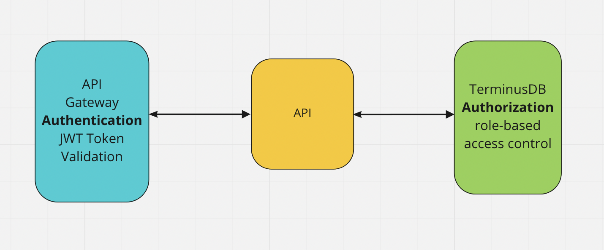

# TerminusDB Role-Based Access Control


Here the full [documentation](https://terminusdb.github.io/terminusdb-access-control/#/) 

## Access control tutorial

In this tutorial, you will learn about the role-based access control in [TerminusDB](https://terminusdb.com). 
We are going to use the [AccessControl](https://terminusdb.com/docs/js-access-control) driver in the TerminusDB JavaScript Client Library to access the TerminusDB system database and manage the access control for three different users.

## Access control explained
The purpose of access control is to establish who the user is and what thye can access. It is also essential to actively prevent users from accessing anything they should not and the required security for a particular resource is enforced. At a high level, database access control is a selective restriction of access to data. It consists of two main components: authentication and authorization.

### Authentication
Authentication is a technique used to verify that someone is who they claim to be. Most of the time this verification process includes a username and a password but other methods such as token, PIN number, fingerprint scan, or smart card can be used as well. In order to conduct the process of authentication, it is essential that the user has an account in the system so that the authentication mechanism can interrogate that account.

### Authorization
The authorization process establishes if the user (who is already authenticated) is allowed to access to a resource. In other words, authorization determines what a user is and is not permitted to do. The level of authorization that is given to a user is determined by the user role. 



### Role-Based Access Control in TerminusDB
TerminusDB provides mechanisms to allow users to limit access to their resources. A *role/capability* system ensures that all users can perform only the operations permitted to them.


In order to add users, organizations, and manage access and roles, you need to be the database administrator.
The main concepts of TerminusDB's access control mechinisms are:

#### USER 
The database user has the capability to access a resource with a specific role.

#### Role
Roles group actions that the user can perform, for example an admin roles would include the action create_database.
The default Roles for TerminusDB are: admin (all actions are allowed ) and consumer.
You can create roles in the system database for different access needs. 

#### Capability
A capability is a relationship between a resource (scope) and a role (what the user can do).
A user with a capability/role is allowed to perform a set of actions for an organization and database.

#### Resource
Organization/Team or database

#### Organization/Team
A database or several databases sit under an organization/team. You can have many organizations each with their own group of databases. Users are assigned roles to an organization and that role filters down to the databases within the organization.

#### Database 
Databases belong to an organization and users inherit the organization User Role for the databases within an organization.
You can override this role, adding a capability/role at database level to increase the user's level of access for a particular database.


### Install Terminusdb  Access control

Please [clone and install TerminusDB](https://github.com/terminusdb/terminusdb-bootstrap) and have it
running.

Please clone access control tutorial

```bash
git clone https://github.com/terminusdb/terminusdb-access-control.git
cd terminusdb-access-control
$ npm install

```
Here is the full code [documentation](https://terminusdb.github.io/terminusdb-access-control/#/api/src/index) 

Now run the example.

```bash
$ npm run start
```
