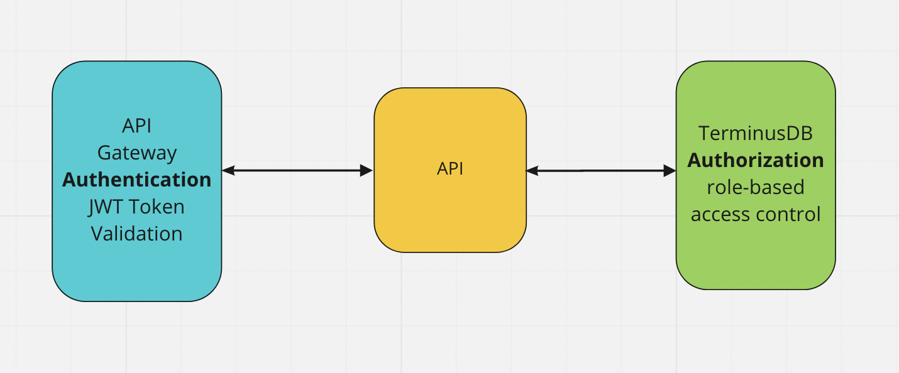

# TerminusDB 


## What is this?

In this tutorial, you will learn about the role-based access control in [TerminusDB](https://terminusdb.com). 
We are going to use the document interface to access the terminusDB system database and manage the access control for three different users. 
We are planning to implement api to cover this functionality in the TerminusDB but in the meantime you can use this solution.

### Install Terminusdb  Access control

Please [clone and install TerminusDB](https://github.com/terminusdb/terminusdb-bootstrap) and have it
running.

Please [clone access control tutorial](https://github.com/terminusdb/terminusdb-bootstrap) 

```bash
git clone ....
cd terminusdb-access-control
$ npm install

```
Please read all documentation before start ....
Now run the example.

```bash
$ npm run dev
```

### What is access control?
At a high level, database access control is a selective restriction of access to data. It consists of two main components: authentication and authorization. In the process of access control, the required security for a particular resource is enforced. Once we establish who the user is and what they can access to, we need to actively prevent that users can access anything they should not.  

### Authentication
Authentication is a technique used to verify that someone is who they claim to be. Most of the time this verification process includes a username and a password but other methods such as JWT token, PIN number, fingerprint scan, smart card and such are adapted as well. In order to conduct the process of authentication, it is essential that the user has an account in the system so that the authentication mechanism can interrogate that account.

### Authorization
In authorization process, it is established if the user (who is already authenticated) is allowed to have access to a resource. In other words, authorization determines what a user is and is not permitted to do. The level of authorization that is to be given to a user is determined by the metadata concerning the user’s account. 



### Role-Based Access Control in TerminusDB
TerminusDB provides mechanisms to allow users to limit the access to their resources. Role/Capability system ensures that all users may perform only the operations permitted to them.


Database superusers admin
You need to be the database administrator to add user, organization and manage access and roles.

We start with the main concepts.

#### USER 
The database user has the capability to access a resource with a specific role.

#### Organization/Team
Group of database

#### Role
The roles are a grouping of actions  that the user can perform. (create_database etc..)
The default Roles that you can find inside terminusDB are: admin (All the actions are allowed ) and consumer.
You can create in the system database roles for different access needs. 

#### Capability
It is a relationship between a resource (scope) and a role (what the user can do).
A capability role defines a set of actions a user assigned the role is allowed to perform over an organization or database.


#### Resource
Organization/Team or Database

#### Database 
The databases belong to an organization and they inherit the organization User Role.
You can override this role, adding a capability/role at database level.